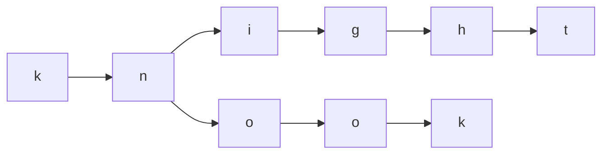
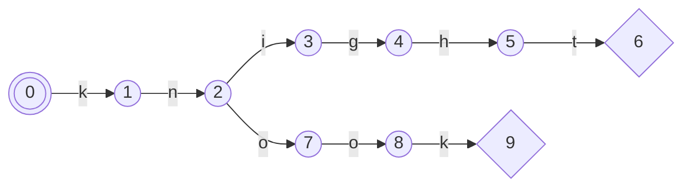
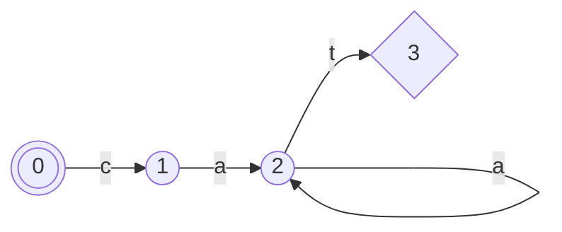
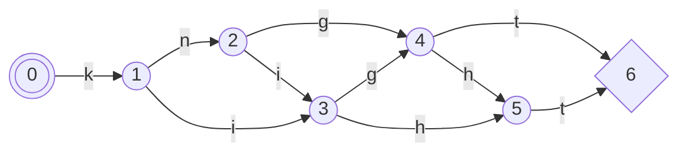
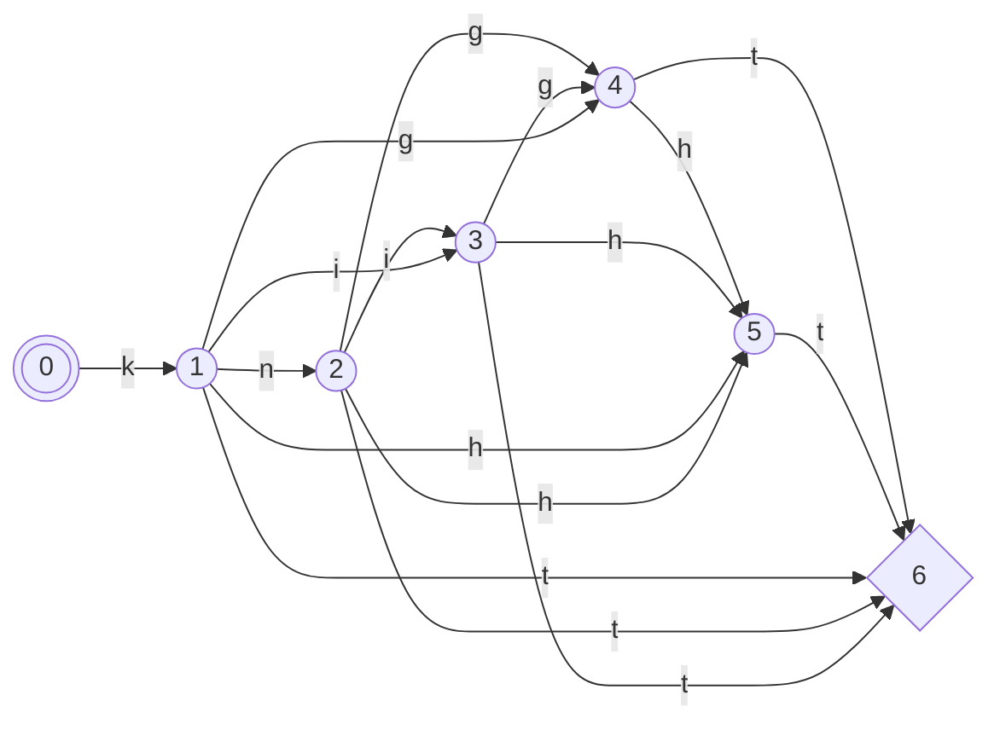
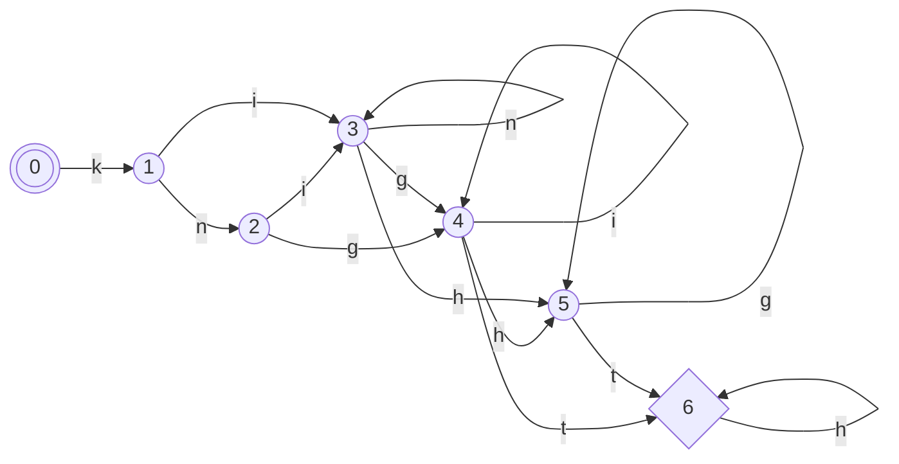
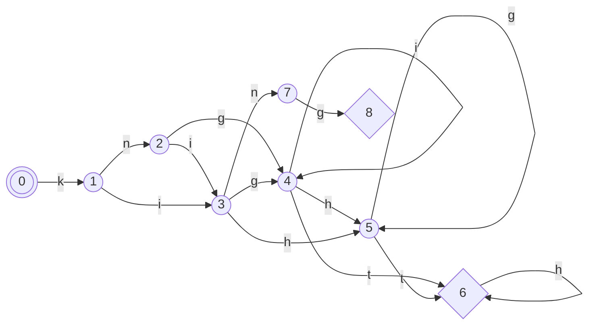

# Natural Language Processing

This is a compiler for code to an abstract syntax tree.

The problem is, that the code is natural language with all its problems. To
solve this, a Lexer / Parser structure is implemented, that squints a lot.

## Lexer

The Lexer is implemented as a table-lexer. This lexer is trained at run-time.
This is possible, because it is trained on complete words and does not have to
cope with regular expressions.

For example the words 'knight' and 'knook' would encode as

As a state diagram

This is implemented as a table parser. For each incoming char one table lookup
is needed.

### Redundancy

There are several ways, to make this parser more tolerant to common typos.
A hard requirement is, that at least the first and the last letter are
correct (To some extend, see below.).

#### Letters can be doubled

This is implemented, that every letter points to itself.

This lexer would accept 'cat', 'caat', 'caaaaaaaaaaat'.

#### Letters can be skipped

By also inserting an arrow to the second to next letter, letters can be left
out.

This is actually for free, because no extra states have to be introduced. Only 
some cells in the table habe to be changed.
Letter skipping can be increased to the max:

#### Letters can be swapped

By combining both techniques above, letter swapping can be caught.

Note, that this parser would match on 'king' as well. It would get stuck in
state 4. So we need to keep the Lexer sane.

#### Keeping the sanity

When generating the Lexer, the words entered are always inscriped hard, so that
the states visited are need to increase. This overwrites any special moves that
might lead to inconsistencies.

The example for 'knight' above when the word 'king' would be added, would look
like:

Words, that are inserted earlier or that are inserted before the additional
state transitions are introduced are more robust to recognize. In the example
above, a misstyped 'kng' would end up in state 4.

For the starting words it is recommended to add all to the parser before
calling the function to add robustness. For the words that are added later on
by using the construct "This is called ...", these words are more robust, when
they are not closely related to a word already used.

Older word concepts are simply overwritten and gone. "The board is square."
followed by "These points are called squares." This would remove the adjective
'square' and replace it with the name for the tiles, that make up the
playingfield.

## Parser

Words are sorted into groups. This behaves like an normal code parser but more
fuzzy. By assigning
[Universal Dependency](https://universaldependencies.org/guidelines.html)
tokens to the words, the token attributes can be used to deduce the abstract
syntax tree represented by the description.

Multiple sentences can form one tree, if the sentences relate each other.

Each of these trees is sorted into a forest:
 * one for the board
 * one for the game specific rules
 * one for the pieces and the piece specific rules
 * one for the starting configuration
